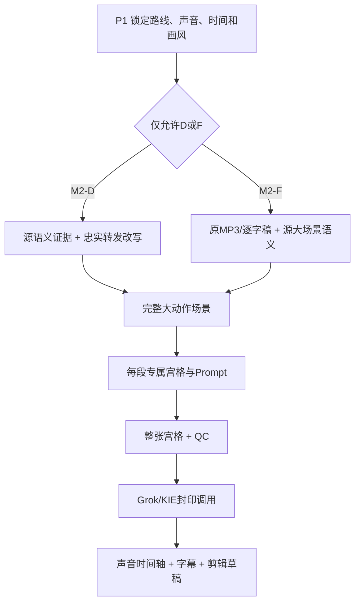

# 双模式架构

| 路线 | 内容权威 | 时间权威 | 允许变化 |
|---|---|---|---|
| M2-D | 源语义单元与通过忠实审核的转发文案 | 最终实测旁白 | 转发包装、全新画面、显式批准的视觉字段 |
| M2-F | 原MP3、逐字稿与源视频大场景动作语义 | 原MP3 | 人物、动物、环境、道具、画风和镜头表现 |

两条路线共享宫格、视觉锚点、供应商、QC、成本和草稿装配骨架；不得共享文案、声音、时间轴、封印和项目血缘。

